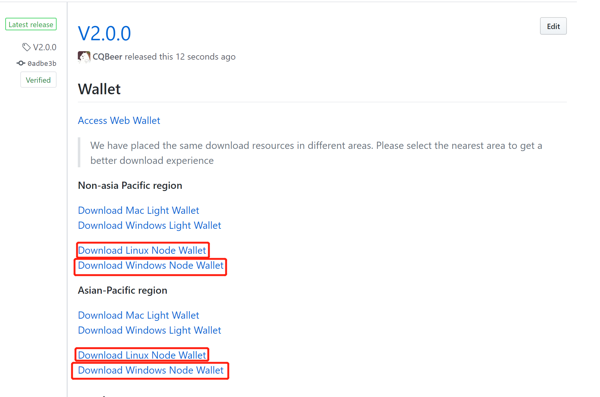
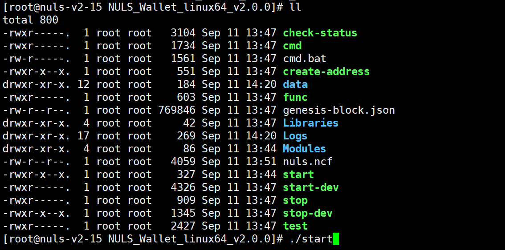
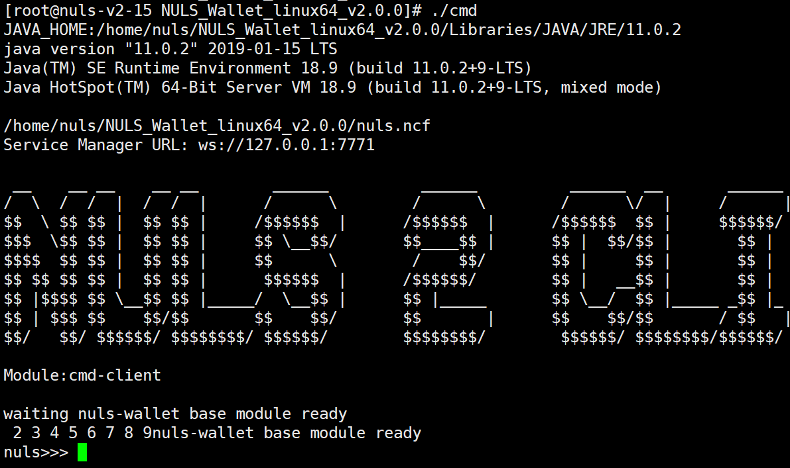
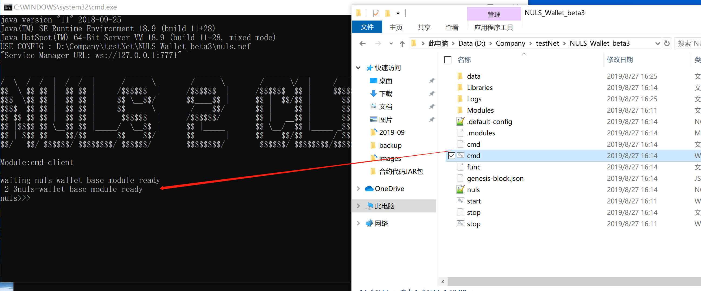
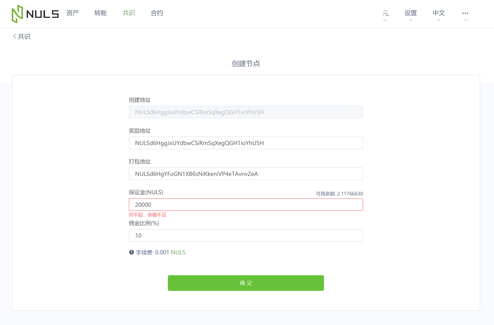

# Create a node

## NULS recommends creating your node for the Test Network first.

You have the option to install and run your node in the Nuls test network or the Nuls production network, Mainnet.  Nuls strongly recommends that FIRST you run your node in test. After you experience the installation and management of your node in test, you are ready to re-install for the mainnet.

For the test network, make sure to open the server ports 18001 and 18002.
For the Mainnet, make sure to open the server ports  8001 and 8002. 
If these ports are not open, your node will not successfully communicate with the blockchain.

## Download Install Node Wallet

1. Download the zipped node wallet package (linux version, windows version) from [GitHub](https://github.com/nuls-io/nuls-v2/releases). For test download the beta version.

2. For linux:

The installation does not require root. This example includes the creation of the user nuls.

 ```
antares:~ # useradd -m -d /home/nuls nuls
New password:
Retype new password:
passwd: password updated successfully
antares:~ #
antares:~ # su - nuls
nuls@antares:~> pwd
/home/nuls
nuls@antares:~>
 ```
Depending on the platform and test/mainnet you are using, download latest version of  'Linux Node Wallet' or 'Windows Node Wallet' from    https://github.com/nuls-io/nuls-v2/releases
Here is a linux example: 

 ```
nuls@antares:~> wget -c http://nuls-usa-west.oss-us-west-1.aliyuncs.com/2.1/NULS_Wallet_linux64_v2.1.0_beta.tar.gz
 --2019-10-27 22:07:18--  http://nuls-usa-west.oss-us-west-1.aliyuncs.com/2.1/NULS_Wallet_linux64_v2.1.0_beta.tar.gz
 Resolving nuls-usa-west.oss-us-west-1.aliyuncs.com (nuls-usa-west.oss-us-west-1.aliyuncs.com)... 47.88.73.131
 Connecting to nuls-usa-west.oss-us-west-1.aliyuncs.com (nuls-usa-west.oss-us-west-1.aliyuncs.com)|47.88.73.131|:80... connected.
 HTTP request sent, awaiting response... 200 OK
 Length: 118128124 (113M) [application/octet-stream]
 Saving to: ‘NULS_Wallet_linux64_v2.1.0_beta.tar.gz’
 
 NULS_Wallet_linux64_v2.1.0_beta.tar.gz   100%[================================================================================>] 112.66M  5.36MB/s    in 21s
 
 2019-10-27 22:07:39 (5.35 MB/s) - ‘NULS_Wallet_linux64_v2.1.0_beta.tar.gz’ saved [118128124/118128124]
 
 nuls@antares:~>
 ```
Then, untar, cd to newly created dirtectory, and start your wallet.:

```
nuls@antares:~> tar -xzvf NULS_Wallet_linux64_v2.1.0_beta.tar.gz
NULS_Wallet_linux64_v2.1.0_beta/
NULS_Wallet_linux64_v2.1.0_beta/Modules/
NULS_Wallet_linux64_v2.1.0_beta/Modules/Nuls/
NULS_Wallet_linux64_v2.1.0_beta/Modules/Nuls/libs/
NULS_Wallet_linux64_v2.1.0_beta/Modules/Nuls/libs/activation-1.1.1.jar
……..
NULS_Wallet_linux64_v2.1.0_beta/stop-dev
NULS_Wallet_linux64_v2.1.0_beta/nuls.ncf
NULS_Wallet_linux64_v2.1.0_beta/genesis-block.json

nuls@antares:~>cd NULS_Wallet_linux64_v2.1.0_beta
nuls@antares:~/NULS_Wallet_linux64_v2.1.0_beta> ls
check-status  cmd  cmd.bat  create-address  data  func  genesis-block.json  Libraries  Logs  Modules  nuls.ncf  start  start-dev  stop  stop-dev  test

nuls@antares:~/NULS_Wallet_linux64_v2.1.0_beta> ./start
nuls@antares:~/NULS_Wallet_linux64_v2.1.0_beta> qt.network.ssl: QSslSocket: cannot resolve CRYPTO_num_locks
qt.network.ssl: QSslSocket: cannot resolve CRYPTO_set_id_callback
qt.network.ssl: QSslSocket: cannot resolve CRYPTO_set_locking_callback
qt.network.ssl: QSslSocket: cannot resolve ERR_free_strings
…
qt.network.ssl: QSslSocket: cannot resolve SSLeay
qt.network.ssl: Incompatible version of OpenSSL

nuls@antares:~/NULS_Wallet_linux64_v2.1.0_beta>
```
Note, you may have some extraneous messages, such as the ones listed in this example.  Continue with the  creation of the beta node, and check with telegram "nuls node owners" for feedback.  If you are creating a mainnet node and the messages are unfamiliar to you, consult telegram "nuls node owners" before proceeding.

User the command "./check-status" to confirm the node has started.

After the node has started, Enter "./cmd" and check to see id the node has 
```
nuls@antares:~/NULS_Wallet_linux64_v2.1.0_beta> ./cmd
JAVA_HOME:/home/nuls/NULS_Wallet_linux64_v2.1.0_beta/Libraries/JAVA/JRE/11.0.2
java version "11.0.2" 2019-01-15 LTS
Java(TM) SE Runtime Environment 18.9 (build 11.0.2+9-LTS)
Java HotSpot(TM) 64-Bit Server VM 18.9 (build 11.0.2+9-LTS, mixed mode)

/home/nuls/NULS_Wallet_linux64_v2.1.0_beta/nuls.ncf
Service Manager URL: ws://127.0.0.1:7771

 __    __ __    __ __        ______          ______          ______  __       ______
/  \  /  /  |  /  /  |      /      \        /      \        /      \/  |     /      |
$$  \ $$ $$ |  $$ $$ |     /$$$$$$  |      /$$$$$$  |      /$$$$$$  $$ |     $$$$$$/
$$$  \$$ $$ |  $$ $$ |     $$ \__$$/       $$____$$ |      $$ |  $$/$$ |       $$ |
$$$$  $$ $$ |  $$ $$ |     $$      \        /    $$/       $$ |     $$ |       $$ |
$$ $$ $$ $$ |  $$ $$ |      $$$$$$  |      /$$$$$$/        $$ |   __$$ |       $$ |
$$ |$$$$ $$ \__$$ $$ |_____/  \__$$ |      $$ |_____       $$ \__/  $$ |_____ _$$ |_
$$ | $$$ $$    $$/$$       $$    $$/       $$       |      $$    $$/$$       / $$   |
$$/   $$/ $$$$$$/ $$$$$$$$/ $$$$$$/        $$$$$$$$/        $$$$$$/ $$$$$$$$/$$$$$$/

Module:cmd-client

waiting nuls-wallet base module ready
 2 3nuls-wallet base module ready
nuls>>>

```




The linux user starts the wallet with the **./start** command. After each module starts successfully, the command line is entered through the **./cmd** command. After the block is synchronized to the latest height, other operations can be performed.





3. For windows:

Windows users double-click **start.bat** in the folder to start the wallet. After the module is successfully started, double-click **cmd.bat** to enter the command line. After the block is synchronized to the latest height, other operations can be performed.





## Wait for your node to sync with the blockchain

Here we deviate between test and mainnet.

For test, you wait.  It's going to be at least one or two hours. ***

For the mainnet, you can download the 
Download 'Data Package' from the same link as step 5] , this will help to speed up the synchronization process. Copy this file inside directory created in step 7] and uncompress it

9] Move the compressed files to Download directory ( step 4] )

10] Inside application directory start the command line:  ./cmd

## How to confirm your node has sync'd with the test/ mainnet chain

Use the command "network info" to determine if the sync has completed or how close yo uare to a complete sync/
```
nuls>>> network info
{
  "localBestHeight" : 4219,
  "netBestHeight" : 338394,
  "timeOffset" : -1,
  "inCount" : 0,
  "outCount" : 13
}
nuls>>>

```
The sync is complete when the localBestHeight is equal to the netBestHeight.
Here is an example. 

```

nuls>>> network info
{
  "localBestHeight" : 347027,
  "netBestHeight" : 347027,
  "timeOffset" : -4,
  "inCount" : 34,
  "outCount" : 8
}
nuls>>>
```


## Import your Packing Account

Once your node has sync'd with the blockchain, import the packing account.  The password indicate to the node that this account is the "package account".

Import the packing address using the import command, and provide the private key.
A successfuil import will display your packing address, after the import is complete.


```
nuls>>> import b54db432bba7e13a6c4a28f65b925b18e63bcb79143f7b894fa735d5d3d09db5
Please enter the password (password is between 8 and 20 inclusive of numbers and letters), If you do not want to set a password, return directly.
Enter your password:**********
Please confirm new password:**********
tNULSeBaMkrt4z9FYEkkR9D6choPVvQr94oYZp

# The password for the imported address must be nuls123456
# You will be asked to enter the password twice
```
## Download Light Wallet Installation -- Required to define consensus node

Users download and open the light wallet (windows version, mac version) from [GitHub](https://github.com/nuls-io/nuls-v2/releases) and connect to the node service.


## Creating a consensus node

The user creates a consensus node on the light wallet (the reward address can be the same as the creation address, or it can be another address, the package address cannot be the creation address and reward address, the deposit is 20000-200000, the commission ratio is 10-100 integer)




## Participation

The user opens the light wallet or [web wallet](wallet.nuls.io), imports the 1.0 private key or keystore file, enters the consensus page, selects the node to commission


