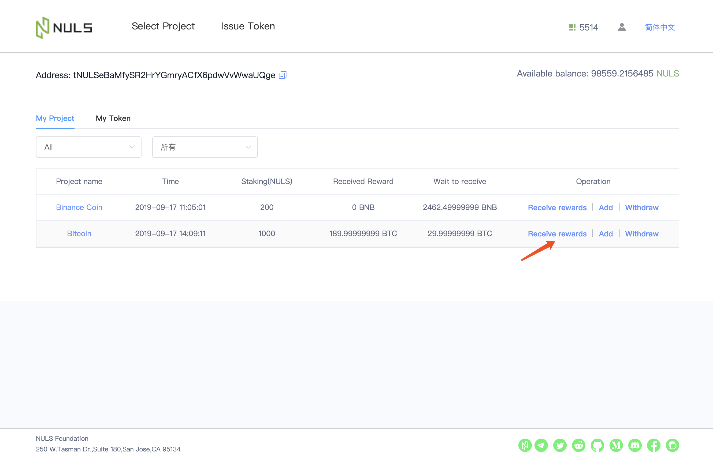
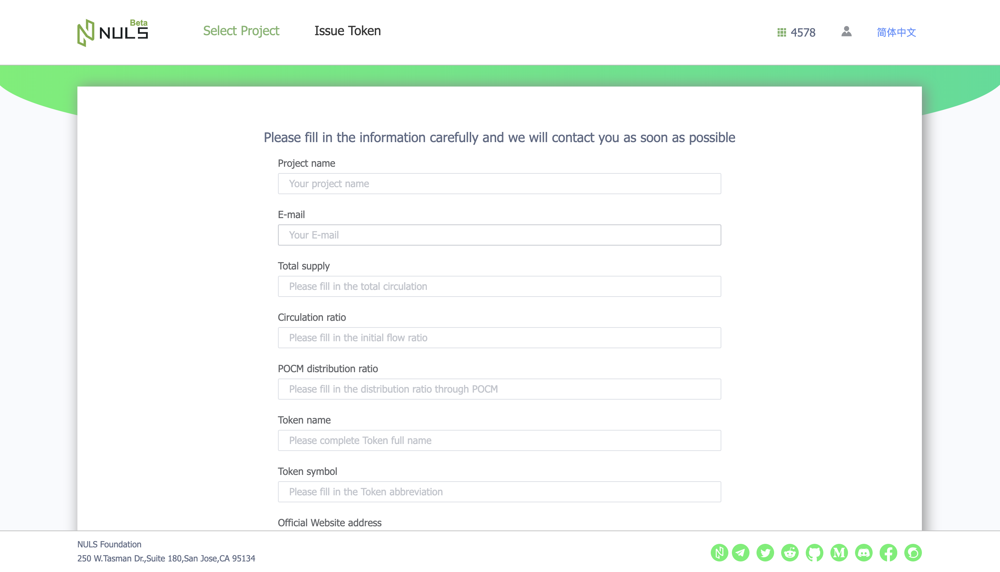
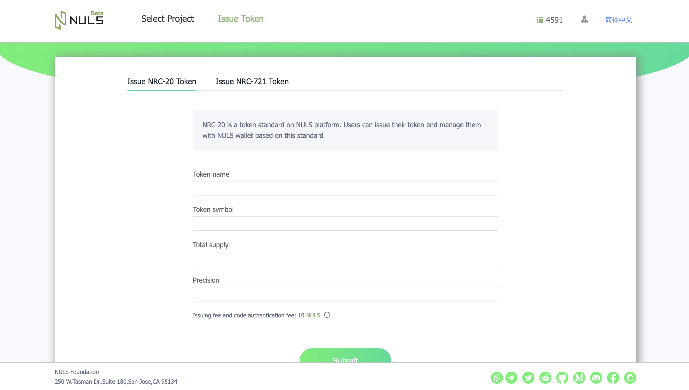
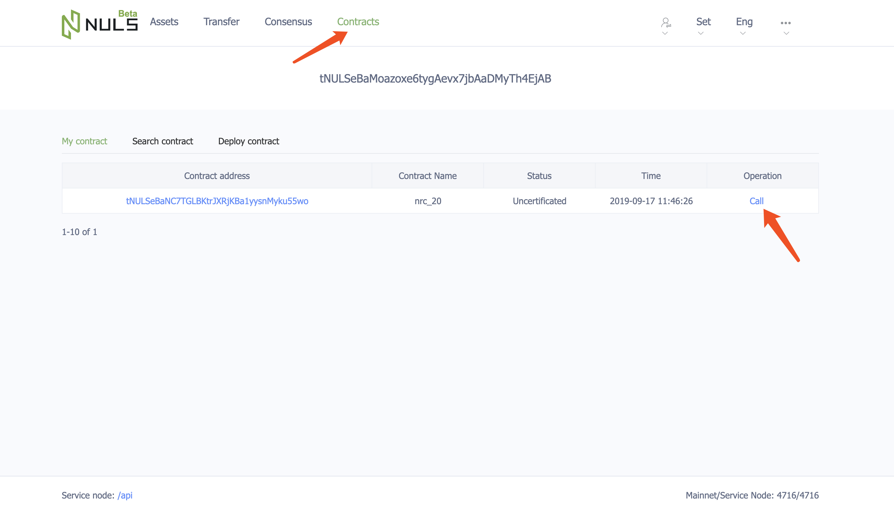
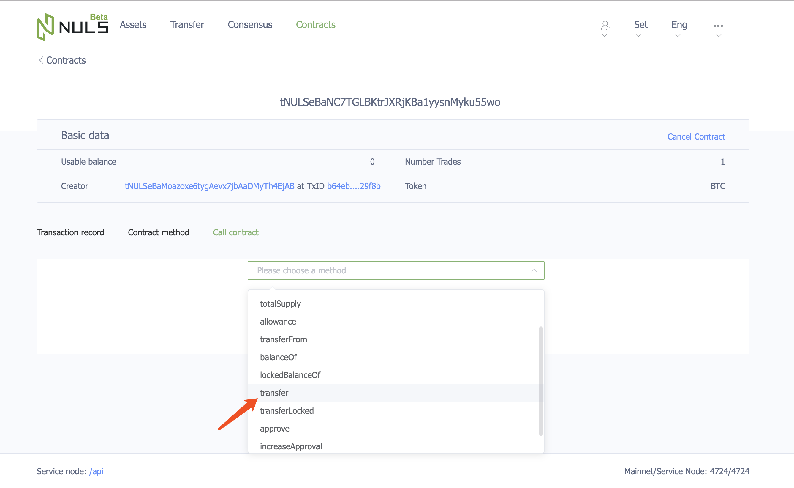
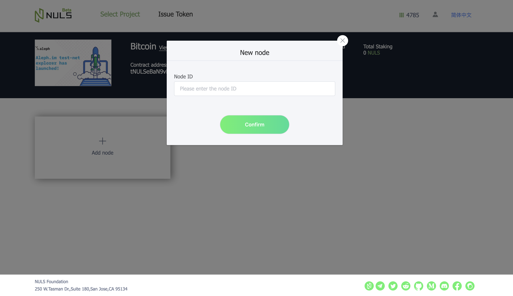
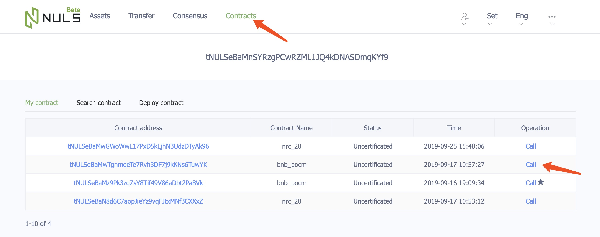
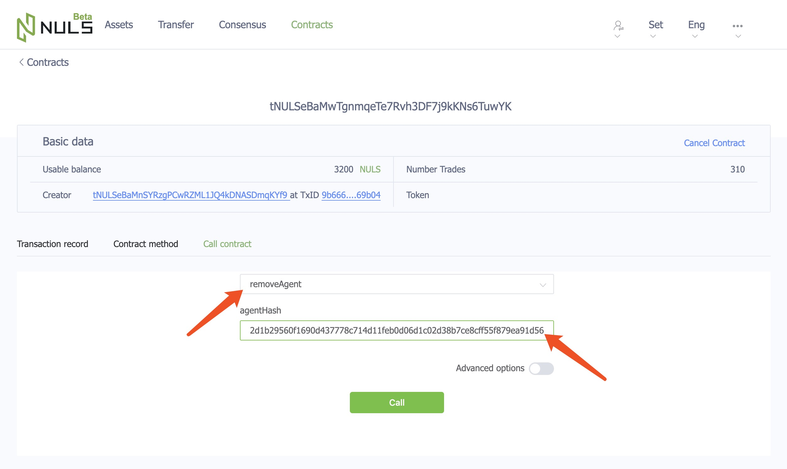

# POCM Tutorial

The SCO platform allows projects to use smart-contract based POCM (Proof of Credit Mining) to create a SCO (Staked Coin Output) node. NULS holders can stake into the projects' SCO nodes and receive the newly-generated project tokens, instead of their usual NULS staking rewards. The SCO project node continuously earns the NULS staking rewards that would otherwise be rewarded to the NULS stakers, and projects can use the rewards to bootstrap and help fund development. The SCO platform and POCM allow this same functionality to be used with any public chain or assets in any blockchain ecosystem

## Test environment
POCM is a decentralized product based on smart contracts. Users (especially project issuers) can familiarize it with the operational process in the test environment, avoiding misuse and causing asset losses.

- POCM test environment：[http://beta.pocm.nuls.io/](http://beta.pocm.nuls.io/)
- Light wallet test environment：[https://beta.wallet.nuls.io](https://beta.wallet.nuls.io)
- Explorer test environment:[http://beta.nulscan.io/](http://beta.nulscan.io/)

## NULS holders

You can stake your NULS to the project you like, and then you can get Token from the project, and the NULS used for staking will not be lost. The steps of NULS holder participation on the POCM platform are as follows:

### Participate POCM

On the [pocm platform](https://pocm.nuls.io/), click the [Select Item] menu, enter the page and select the approved item, click to enter the item details page.

On the project details page, enter the number of NULS you want to stake (the amount of staking cannot be lower than the minimum value set by the project team, the value can be viewed in the project details), click [Participate POCM]

### Receiving rewards

The contract will be awarded once every 5 blocks.After the reward is issued, the user needs to click the [Receive reward] on the right side of the [User Center] page. After the successful receiving, the contract will transfer the rewards to the participating address in real time. After the lockout time is over, the Token can be used (the specific unlock time can be viewed in Project details)

> Receiving a reward is an operation that calls a contract, so you need to consume a small amount of NULS

### Add rewards

The user can continue to participate in the pocm of a certain item in the project details, or add it via the [ Add ] button on the right side of the participating item list on the [User Center] page.

## Project team

You can use [POCM (SCO distribution platform) ](https://pocm.nuls.io/) to attract NULS community members as the first group of supporters, continue to obtain NULS consensus reward as the project development fund, and get full empowerment of NULS community and ecology.The steps to participate are as follows:

### Submit basic information

Click the [Select Item] menu on the pocm platform, enter the page, click the [Issue Project] button and fill in the basic information and submit

### Issued Token

After submitting the basic information, the project team should send an email to pen@nuls.io, which contains the following contents:
- project name
- provide an account address (please take care of the private key of the address) for subsequent publishing of POCM contracts

Upon confirmation of the reply, users can import the account on POCM platform and enter the [user center] page to issue POCM contracts

### Issue pocm contract

After the basic information is approved, the project team needs to provide an account address (please keep the address private key) to the platform, the account address will be authorized, then import the account into the POCM platform, and then go to the [User Center] page to issue POCM contract

Fill the form and publish the contract according to the project team's own POCM distribution rules

### Transfer the token to the contract

 Import the address holding the token into the [wallet](https://wallet.nuls.io/), go to the [ Contract ] page, find the token and click [ call ]

Go to the calling page and select the `transfer` method of the token contract.

Fill in the POCM contract address that has been successfully issued, and then fill in the number of Tokens transferred (because of the calculation unit, you need to add n zero after the actual number,n = the decimal of the token you issued ） and finally click [ call ]

At this point, the user can already see the project information on the pocm platform and stake NULS for new tokens

### Add node

**On the NULS network, the reward generated by staking NULS to the consensus node will be split into two parts:**
- Consensus node commission (consensus rewards generated by the commission * consensus node commission ratio), this part is directly assigned to the reward address of the consensus node
- Staking rewards (consensus rewards generated by staking - Consensus awards generated by staing * Consensus node commission ratio), which is directly assigned to the staking address

On the POCM platform, the POCM contract will stake the NULS that the user delegate to the contract to the consensus node that you added. The contract address will receive the staking rewards generated by staking. The creation address of the contract has the authority to transfer the staking reward.You can invokes the `transferConsensusRewardByOwner ` method in [contracts] page for Reward transfering.

**There are two ways to get a node:**
-  [Create Node](https://docs.nuls.io/zh/Guide/g_pocm.html)by yourself. With this method, you can receive both the consensus node commission and the staking reward.
- Use the consensus node already on the NULS network. With this method, you can only receive the staking reward.

**How to add nodes:**

On the POCM platform, click [User Center], enter the page and click [Add Node] to enter the ID of the node.

After the node is successfully added, the POCM contract will stake the NULS of the user delegated to the added nodes in turn. If there are multiple nodes, the order of staking is the order of adding the nodes.

If you need to delete an added node, you need to enter the [Contract] page of the wallet (the operation address should be which creates the POCM contract), find the POCM contract, click [call]

Select the contract's `removeAgent` method, enter the node's hash value, click [call].The node will be deleted successfully after the contract is successfully called

On the next version of the POCM product, you will be able to delete nodes directly on the [User Center] page. Please wait patiently.

## Consensus node

As a consensus node On the NULS network, you can work with the project team. The way is: Project team can can add your node as the running node of the project on POCM platform, so that the NULS delegate by the users into the project contract will be automatically stake to your node. Node can obtain the following two parts of rewards

- the node's staking will increase, so the node will receive more NULS commissions
- node [create address] will receive tokens from the project, the number of tokens is directly proportional to the deposit of the node, the detailed formula is: the number of tokens obtained by the node = your node deposit/(the total number of NULS delegate to the project by the user * 0.9 + the total amount of deposits of all nodes running on the project) * the total number of tokens distributed by the project 

**receive tokens distributed by the project:** import the create address of the node on POCM platform, then enter [user center] and click [receive rewards] on the right side of the list,then you can see tokens on your wallet asset page