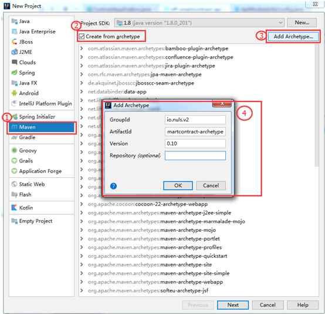
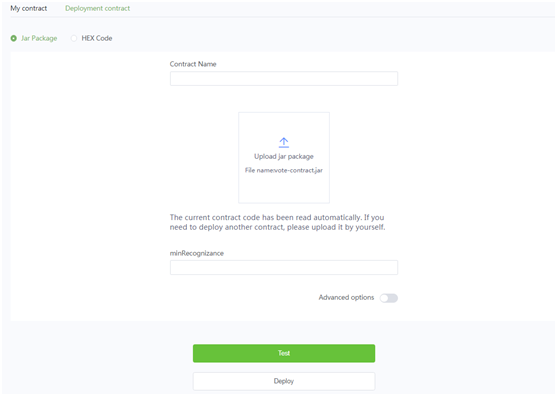
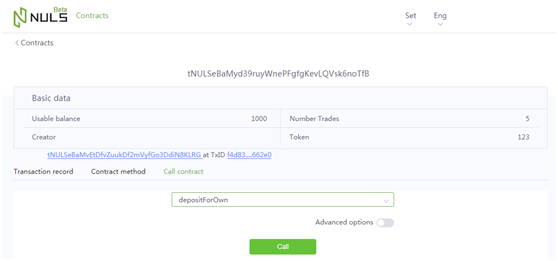
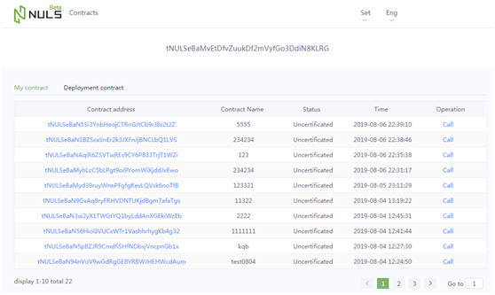
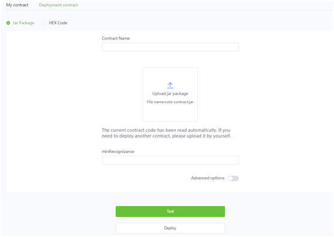

# Development Tool

## NULS smart contract Maven-archetype usage documentation

### Introduction to NULS Smart Contract Maven-archetype

The NULS smart contract Maven-archetype is a smart contract Maven project template defined for developers. Adding the Maven archetype to IntelliJ IDEA and selecting this archetype can quickly generate a NULS smart contract development project. The smart contract project is a maven project with a sample contract class and all required NULS smart contract dependencies are automatically added to the project. Developers only need to focus on code development for smart contract business logic.

The maven archetype also integrates an offline smart contract client. After the smart contract is packaged through maven, the offline smart contract client is automatically launched, and the developer deploys the smart contract and the contract method call on the client.

### New NULS Smart Contract Maven Project

1、In order to solve the problem of Intellij IDEA creating a Maven project through archetype slowly, increase the maven run parameters: 
-DarchetypeCatalog=internal，The operation steps are as follows:

2、Select the new maven project in IntelliJ IDEA and add the NULS smart contract Maven archetype to IDEA in the order shown below (Figure 1). The parameters when adding archetype are as follows:

         GroupId：io.nuls.v2
         ArtifactId: nuls-smartcontract-archetype 
         Version: 0.11

3、Select "io.nuls.v2:nuls-smartcontract-archetype" and click Next to create a Maven project as shown below (Figure 2).

> When you first create it, you may wait 2~3 minutes, please be patient

4、The resulting maven project is shown in the following figure (Figure 3). The pom.xml file has been added to the dependency jar required by the NULS smart contract. The developer does not need to modify this file.

5、Start the business code development of the NULS smart contract, see https://github.com/CCC-NULS/pocm-contract

### Packing NULS Smart Contracts

After completing the development of the smart contract, the smart contract is packaged through the “mvn clean pakcage” command or IDEA's maven plugin. After the package is completed, the offline smart contract client will be launched, and the developer can deploy and invoke the smart contract on this client.

### Deployment contract

On the "Deployment Contracts" page, the jar package under the target directory of the current smart contract project is automatically loaded, which is the default path for maven packaging. If the developer needs to deploy other jar packages, you can choose another jar package to upload and deploy.

### Call contract

After the contract is successfully deployed, it will be displayed in the list of the “My Contracts” page. The developer clicks the “call” button of the corresponding contract to enter the calling contract page, select the contract method to be called, fill in the parameters related to the contract method, and click “ Call "to complete the call of the contract method. As shown below.

### Offline Smart Contract Client Introduction

The main function of the offline smart contract client is to deploy and publish smart contracts. It also provides functions such as account creation and import, and maintenance of the NULS API module service node address. The main page of the client includes my contract, deployment contract, account management, and service node.

The main advantage of the offline smart contract client is that the developer does not need to deploy the NULS wallet locally, and only runs the client to deploy smart contracts and legal method calls.

#### My contract

On the "My Contracts" page, you can view the list of contracts that have been deployed under the selected account address. Click the "Call" button to enter the calling page of the contract method.

#### Deployment contract

To deploy the contract on the “Deployment Contract” page, you can select the “jar package” or “HEX code” to deploy the contract.

#### Account management

Before the smart contract is deployed and released, the account address must be selected through the “Enter” button. If there is no account information, it can be realized by creating an account or importing an account. The operation page is shown below.

#### Service List

All service nodes are displayed in the service list. The service node refers to the URL address of the NULS API module. When the service address is not selected, http://apitn1.nulscan.io is used by default. The operation page is as shown in the following figure.

